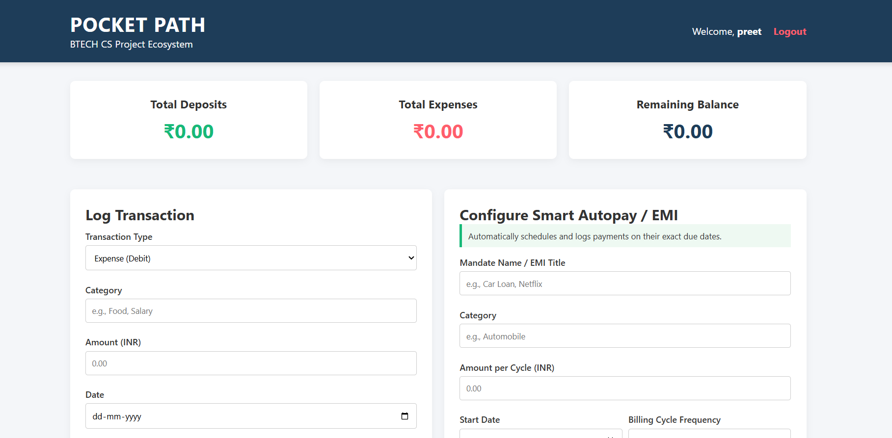
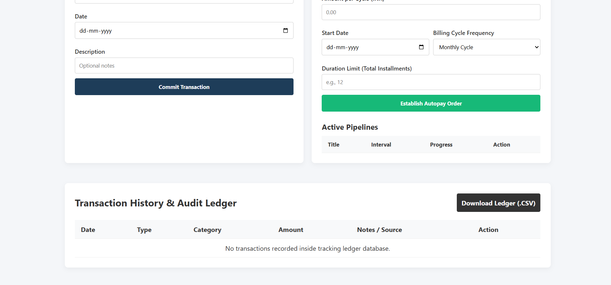
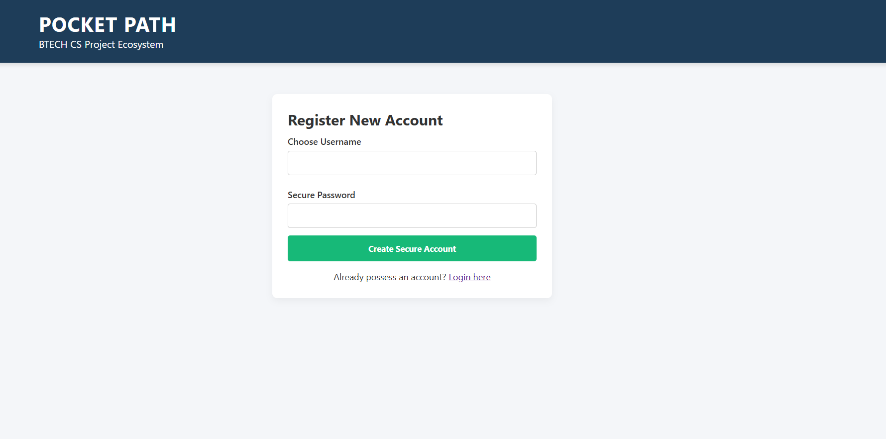
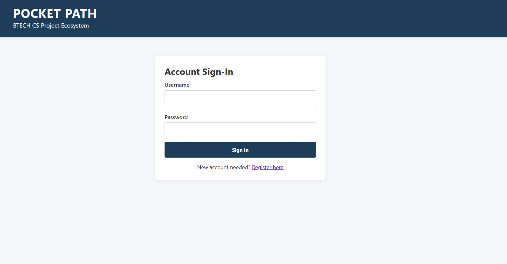

# 💰 Pocket Path

### Smart Personal Finance & Expense Tracker

Pocket Path is a full-stack web application built with Python and Flask that helps users manage their personal finances efficiently. Users can track income, expenses, account balance, recurring payments, and download transaction records through a clean and responsive interface.



---

## ✨ Features

* 🔐 Secure user authentication and account management
* 💸 Add and manage income and expense transactions
* 📊 Real-time balance calculation and financial overview
* 🤖 Automated EMI and subscription payment tracking
* 📅 Support for recurring monthly and yearly payments
* 📥 Export transaction history as CSV files
* 🗑️ Delete transactions and cancel recurring payments
* 📱 Mobile-friendly and responsive UI

---

## 🚀 Installation & Setup

### 1. Clone the Repository

```bash
git clone https://github.com/preetbadera/Pocket-Path.git
cd pocket-path
```

### 2. Install Dependencies

```bash
pip install -r requirements.txt
```

### 3. Run the Application

```bash
python app.py
```

### 4. Open in Browser

Visit:

```text
http://127.0.0.1:5000/
```

---

## 🛠️ Tech Stack

| Technology  | Purpose                             |
| ----------- | ----------------------------------- |
| Python      | Backend Development                 |
| Flask       | Web Framework                       |
| Flask-Login | Authentication & Session Management |
| SQLite      | Database                            |
| HTML5       | Frontend Structure                  |
| CSS3        | Styling & Responsive Design         |

---

## 📂 Project Structure

```text
pocket_path/
│
├── app.py
├── requirements.txt
│
├── templates/
│   ├── layout.html
│   └── index.html
│
└── static/
    └── style.css
```

---

## ⚙️ How It Works

Pocket Path allows users to securely manage their financial activities through a centralized dashboard.

Users can:

* Record deposits and expenses
* Monitor available balance
* Set up recurring EMIs or subscriptions
* Automatically track installment schedules
* Export transaction records for future reference

The application automatically processes recurring payments based on predefined schedules, reducing manual tracking efforts.

---
<h2>📸 More Screenshots</h2>

<p align="center">
  
  
</p>

<p align="center">
  
</p>

---

## 🔮 Future Enhancements

* Data visualization and expense analytics
* Category-wise spending reports
* Email reminders for upcoming payments
* Budget planning and goal tracking
* Cloud database integration
* Dark mode support

---

## 👨‍💻 Author

**Preet Badera**

Python Developer | Web Developer | Open Source Enthusiast

Feel free to connect and contribute to the project.
